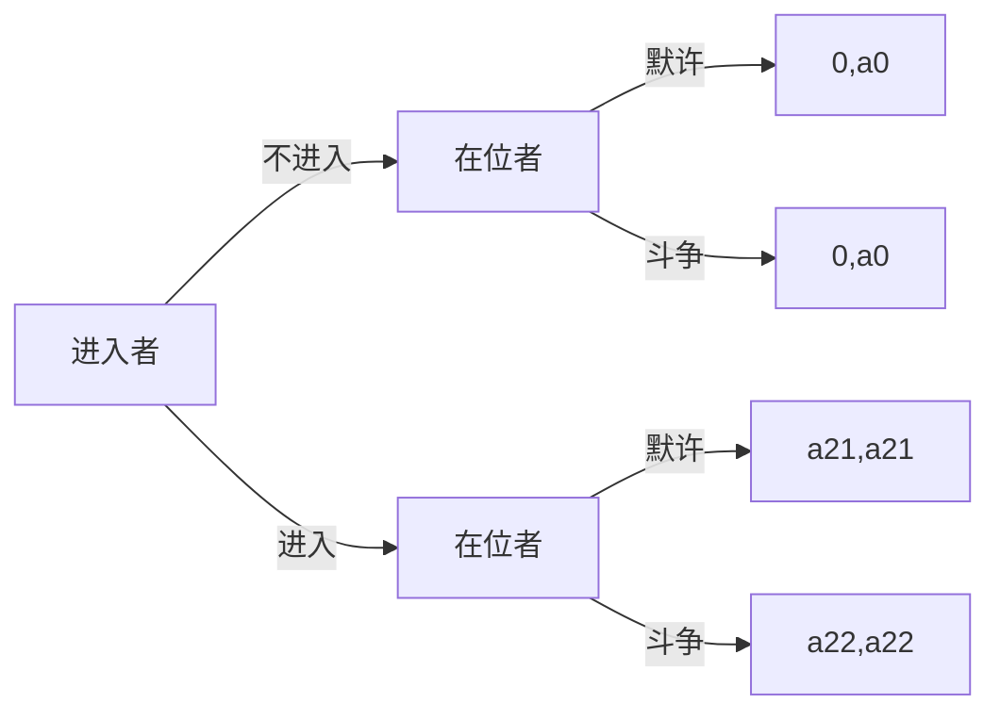
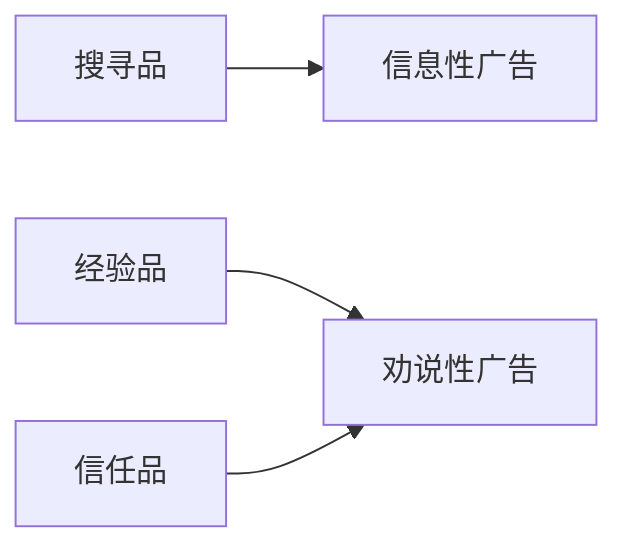

# 产业经济学

## 第一章

### 产业经济学研究领域与内容

- 产业组织
- 产业结构
- 产业关联
- 产业布局
- 产业发展
- 产业政策

### 邮政产业经济学的含义

邮政产业经济学是以理论经济学为基础，研究邮政产业经济活动的基本特征及其变动规律，探讨制定邮政产业政策的理论基础和方法，指导邮政产业的运行和发展，实现资源在邮政产业内和不同产业间的有效配置。

### 邮政产业经济学的研究对象

邮政产业经济学的研究对象是邮政产业，邮政产业包括邮政，快递与物流

### 经济学划分

#### 理论与应用

经济学分为理论经济学和应用经济学。产业经济学以理论经济学为基础，研究产业经济活动的基本特征及其变动规律，探讨制定产业政策的理论基础和方法，指导国民经济中各产业的运行和发展，实现资源在产业内、产业间的有效配置，具有鲜明的实践性和应用性。 因此，产业经济学属于应用经济学中的二级学科。

#### 宏观微观

产业经济学既不同于以单个市场主体(企业、消费者)为研究对象的==微观经济学== ，又不同于以国民经济总量为研究对象的==宏观经济学==。 产业经济学研究产业的基本特征、产业中企业间的现实竞争关系以及不同产业之间的相互关系，覆盖了被宏观经济、微观经济研究所忽略的领域。 因此，从研究对象看，产业经济学是介于微观经济学和宏观经济学之间的**中观经济学**。

## 第二章

### 产业组织理论

产业组织理论的思想渊源:    亚当斯密国富论关于市场竞争机制的论述
> 在自由竞争的市场体制下，竞争的结果总是促使市场价格与生产者的成本趋于一致，他还论述了劳动分工可以提高生产效率，因此合理的生产组织能带来社会资源的节约。

奠基者:    马歇尔 提出了产业组织的概念，揭示了市场运行中的主要矛盾

马歇尔冲突：    规模经济与垄断通病时间的矛盾
> 大规模生产能提高企业的生产效 率，但企业追求规模经济的结果必然导致市场垄断，而垄断发展到一 定程度又必然阻止竞争，使市场经济丧失活力，造成资源的不合理配置。

新古典经济学:    现代西方经济学历经了“张伯伦革命”、“凯恩斯革命”和 “预期革命”等所谓三次大的革命，形成了包括微观经济学和宏观经济学的 基本理论框架，这个框架被称为新古典经济学以区别于先前的古典经济学。 分析基础为`完全竞争市场`

#### 哈佛学派，SCP分析范式

哈佛学派的产业组织理论以垄断竞争理论为基础，以实证研究为主要手段，将特定产业(市场)的分析分解为结构、行为和绩效三个方面，构造了一个既能深入具体环节，又有系统逻辑体系的 **市场结构(structure)**-**市场行为(conduct)**-**市场绩效 (performance)** 的分析框架(简称SCP)，形成了完整的产业组织理论体系。

| 名称     | 定义                                         | 包含内容                                                                   |
| :------- | -------------------------------------------- | -------------------------------------------------------------------------- |
| 市场结构 | 指决定某一特定市场竞争程度的因素             | 卖者的数量、产品的差异化程度、进入壁垒                                     |
| 市场行为 | 企业在市场竞争和相互博弈中所采取的策略和行为 | 决定价格、产量、研究与开发                                                 |
| 市场绩效 | 市场运行的效率                               | 企业的市场行为所形成的资源配置、技术进步和规模经济实现程度等方面的现实状态 |

哈佛学派认为，这三者存在因果关系 即 结构决定行为 行为决定绩效，而市场结构又取决于于一些外生的基本条件，如产品的生产技术和市场需求。
> 后期研究发现三者绝不是 简单单向因果关系，而是双向的、相互影响的多种关系，，比如企业的研发活动会改变生产技术，从而影响市场结构；企业也可通过大规模的广告改变消费者的偏好并影响市场结构。

在SCP分析框架中，运用案例和计量手段来分析**验证S、C、P之间的关系**便成为研究的重点，而作为市场结构之一的**集中度**和作为市场绩效基准之一的**利润率**之间**关系**的研究处于核心地位。

##### 集中度-利润率假说

在具有寡占或垄断市场结构的产业中，由于存在少数企业间的共谋、协调行为以及通过高进入壁垒限制竞争的行为，削弱了市场的竞争性，其结果往往是产生超额利润，破坏资源配置效率
> 如果存在着集中的市场结构，厂商就有可能成功地限制产出，把价格提高到正常收益以上的水平。

##### 公共政策

应采取企业分割、禁止兼并等直接作用于市场结构的产业组织政策来调整和改善不合理的市场结构，限制垄断力量的发展，保持市场的有效竞争。

##### 局限性

 强调经验性的产业研究,注重从经验观察中获取结论和命题,缺乏坚实的理论基础和系统的理论分析。

#### 芝加哥学派，可竞争市场理论

##### 理论

**信奉自由市场机制和价格理论**，相信市场力量的自我调节能力。

##### 主张

**国家应尽量减少对市场竞争过程的干预**，把干预仅仅限制在为市场竞争过程确定制度框架的条件上，并认为**市场均衡是不能通过人为的政策干预加以实现的**，而只能通过市场竞争过程强迫经济主体不断适应这种本身也不断变化着的市场均衡。

##### 方法论

侧重理论分析和均衡分析方法
强调**新古典经济学价格理论**对观察到的经济行为的解释能力，坚持认为产业组织及公共政策问题仍应该 价格理论的角度来研究，试图以价格理论中的完全竞争和垄断两个基本模型作为分析产业组织问题的基础

他们不认可“集中度-利润率”假说 认为即使在高度集中的市场中，企业拥有市场权力并获得超额利润，但这只是市场处于非均衡状态时的暂时现象，只要不存在政府对进入市场的人为限制，这一现象会随着市场趋向均衡而消失。

对于**SCP**来说 芝加哥学派认为由市场绩效与市场行为决定市场结构
> 正是由于一些企业在激烈的市场竞争中能取得更高的生产效率，所以他们才能获得超额利润，并进而促进企业规模的扩大和市场集中度的提高，形成以大企业和高集中度为特征的市场结构。

##### 对于垄断的看法

- 芝加哥学派**坚信唯有自由的企业制度和自由的市场竞争秩序**，才是提高产业活动效率、保证消费者福利最大化的基本条件。
- 他们**认为实施反垄断和规制政策的目的，在于提高市场运行的效率**。生产日益集中在大企业手里，有利于提高规模经济效益和生产效率；大企业的高利润完全可能是经营活动高效率的结果，而与市场垄断势力无关。
- 因此，**他们反对哈佛学派所主张的对长期存在的过度集中的市场结构进行直接干预并对大企业采取分割和实行严格的兼并控制的政策**，认为这种做法破坏了效率增长的源泉。
- 他们**主张放松反托拉斯法的实施，尽可能减少政府对产业经济活动的干预**，以扩大企业和私人的自由经济活动范围。

因为20实际六七十年代出现的问题被归咎于哈佛学派的反垄断与规制政策，所以70年代以后的10-12年间 芝加哥学派作为了主宰

##### **可竞争市场理论**

可竞争市场理论是由美国经济学家鲍莫尔等人在芝加哥学派理论的基础上提出来的，可竞争市场理论是以**完全可竞争市场**和**沉没成本**等概念为中心，来推导和说明**高集中度的市场结构是可以和经济效率并存的**。

完全可竞争市场:    市场内的企业当其从该市场退出时完全不用担负不可回收的沉没成本，从而进入和退出完全自由的市场。

由于不存在沉没成本，企业进入和退出市场是完全自由的，因此相对于在位企业，潜在进入者在生产技术、产品质量、成本等方面并不存在任何劣势。潜在进入者为追求利润会迅速进入一个具有经济利润的完全可竞争市场，而当在位者做出报复性反应使价格下降到无利可图时，他们会无障碍地快速撤出。

由于这种闪电般的进入或退出压力经常存在，因此无论是垄断市场还是寡占市场，企业就只能指定超额利润为零的可维持价格，以防止潜在的竞争者进入市场与其发生竞争；**任何企业都不能获得超额垄断利润，高集中的市场与经济效率可以并存**。

由此可见，**可竞争性实质是指来自潜在进入者的竞争压力对正在市场上的供给者行为施加的约束，这种约束越强，在位企业的行为越接近于竞争市场上企业的行为**。

**政策**:    垄断并不必然使福利受损，在近似的可竞争市场中，**自由放任政策比行政手段或反托拉斯手段主动管制更能保护一般公众的利益**。政府政策应以促进可竞争性为重点，消除一切人为的、不必要的进入和退出壁垒，使新企业有平等的机会参与市场竞争

局限性:    是一个理想化的模型，现实中符合可竞争市场假定条件的产业罕见

#### 新奥地利学派

在米赛斯和哈耶克等人提出的经济思想的基础上形成的产业经济学流派

完全否定新古典主义关于市场运行的完全竞争理论

新奥地利学派从**信息的不完全性、人的有限理性和环境的不确定性**出发来理解市场，在他们看来作为完全竞争理论分析前提的完全信息假设不仅不符合现实，而且还会对人们产生误导。

实际上，无论政府也好个人也好，都不可能掌握完备的知识和信息，这不仅因为知识和信息是分散在千百万人的脑海中，同时因为这些知识和信息是千变万化。

因此，市场运行的根本问题就在于如何发现和利用分散的知识和信息，使资源配置到对社会有更高价值的方面，而这只有通过竞争的市场才能实现。

新奥地利学派把市场看作是分散的知识、信息的发现和利用的过程，**特别强调企业家及其创新精神在这一过程中的重要作用**。

主张自由放任的经济政策，强调反对政府干预，抨击行政垄断。

他们认为政府的知识和信息也是不完全的，政府的干预反而会扭曲市场调整过程，最终损害经济绩效。

##### 对反垄断政策的看法

- 利润是企业家进行了成功创新的报酬，它给企业家传递市场机会的信息，在动态竞争过程中引导企业家不断重新分配资源，以满足消费者的需要。
- 市场竞争的强弱也是无法用集中度或企业数量、市场占有率这些指标来衡量的，因为竞争源于企业家的创新精神，这种创新精神优势其他企业无法夺取的。

只要确保自由的进入机会，充满旺盛创业精神的市场就能形成充分的竞争压力，而这些都与该市场的集中度无关。在他们看来唯一称为市场进入壁垒的是政府的进入规制政策和行政垄断，因此，最有效的促进竞争的手段应该是废除那些过时的规制政策和不必要的行政垄断。

##### 局限性

但是它所鼓吹的极端自由主义的政策主张在经济生活中是不现实的。，因此新奥地利学派的产业组织理论对产业经济学的影响更多是在思想理念方面。

##### 方法论

经济学属于社会科学，是不同于自然科学的所谓“人类行为科学”，反对把自然科学的研究方法运用到经济学的研究之中，主张对经济问题必须与道德伦理、政治学、法学和哲学等联系起来进行研究。他们拒不采用现代数学方法和经济计量技术，而是致力于个人行为的逻辑分析，按照“人类行为是实现其目的的合理行动”这一前提出发，通过逻辑推论发现个人行为和经济现象之间的因果联系。

#### 新产业组织理论

- 在市场结构和行为的关系上，由“结构主义”转向“行为主义”
- 形成了统一的理论研究方法
- 重点研究不完全信息下的企业行为及企业间的动态竞争关系。

 新产业组织理论运用博弈论方法的研究重点是**企业的策略性行为**。

研究方法: 研究方法!G9世纪N9年代以来"产业组织理论在研究方法上发生了巨大变化"博弈论及与其相关的信息经济学!数理经济学!福利经济学等方法相继引入产业组织理论分析"

> 策略性行为是指一家企业为提高其利润所采取的旨在影响市场环境的所有行为。
> 市场环境包括市场中的现有的和潜在的竞争对手数量、行业的生产技术、竞争对手进入该行业的成本和速度以及市场的需求等

策略性行为的研究主要是运用博弈论和信息经济学，通过纳什均衡来阐明企业的行为，分析在既定的初始均衡条件或状态下，如何运用策略性行为实现新的均衡。另一方面，经济全球化和信息时代的市场结构和竞争问题也成为产业经济组织理论研究的一项新课题

新产业组织理论对美国等发达国家的反垄断政策也产生了一定的影响，反垄断的重心从反垄断结构逐步转向反垄断行为，美国的反垄断政策也从前一时期的过于宽松逐步转向温和的干预。

##### 主张

- 从注重反垄断结构到注重反垄断行为的变化
- 目标取向由过去的保护消费者利益#逐渐转移到提高市场效率#在效率优先的前提下兼顾保护消费者利益"
- 反垄断政策有了明显松动
  - 一是伴随着对公用事业部门的自由化和私有化实施放松管制的政策
  - 二是以激励性管制取代过去传统的管制方式
  - 三是在放松经济性管制的同时，强化社会性管制。以加强环境保护，实施可持续发展和保护消费者权益不受侵害"

## 第三章

### 市场类型

分为完全竞争市场->垄断竞争市场->寡头垄断市场->完全垄断市场四种市场类型(市场趋于集中)

### 市场集中度衡量指标

#### 综合反映厂商数目和市场份额分布的指标

某一企业市场份额的大小
$$S_{i}=X_{i}/\sum_{i=1}^{N}X_{i}$$
| 指标名称            | 指标定义                                                                              | 算法                                               |
| ------------------- | ------------------------------------------------------------------------------------- | -------------------------------------------------- |
| 绝对及集中度指标    | 直接将同一市场中最大的n个厂商的市场份额进行加总，反映最大的几家厂商所占的市场份额情况 | $CR_{n}=\sum_{i=1}^{n}S_{i}$                       |
| 赫芬达尔—赫希曼指数 | 指一个行业中所有企业的市场份额的平方和，即市场中企业规模的离散程度                    | $HHI=\sum_{i=1}^{N}(S_{i})^{2}$                    |
| 因托比指数 熵指数   | 借用了信息理论中熵的概念                                                              | $EI=\sum_{i=1}^NS_i(log\frac{1}{S_i})$ 一般log取ln |
| 罗森布鲁斯指数      | 无                                                                                    | $RI=\frac{1}{2\sum_{i=1}^NiS_i-1}$                 |

- 绝对及集中度指标
  - 评价标准:    当n较小而CRn较大时，市场集中度高
  - 优点:    在实际操作中简单易行，并且能够形象地反映市场中的市场集中情况，反映市场中的寡占程度。
  - 缺点:    只是行业中规模最大的几家厂商市场份额的加总，难以反映所有企业的规模分布状况
- 赫芬达尔—赫希曼指数
  - 评价指标:    HHI越接近于1，表示产业内厂商所占资源分布越不均匀
@import "./img/HHI.png"
  - 优点:
    - HHI包含了所有企业的规模信息，能够反映出绝对集中度所无法反映的集中度的差别
    - HHI对产业内规模较大的企业市场份额变化较为敏感，而对规模较小的企业市场
份额变动不太敏。
  - 缺点: 需要收集市场上所有企业市场份额信息，成本较高
- 因托比指数 熵指数
  - 评价指标:    EI值 越大，说明市场集中度越小
  - 优点:    利用了市场中所有企业的市场份额，综合地反映了市场中企业集中度及其分布
  - 缺点:    需要收集市场上所有企业市场份额信息，成本较高
度越大。
- 罗森布鲁斯指数

#### 只反映市场份额分布的指标

##### 洛伦兹曲线

按照市场份额大小由低高排列，计算经过排序的任意百分比企业所占有的累计市场份额，并绘制成曲线。

###### 评价指标

@import "./img/洛伦兹曲线.png"
洛伦兹(劳伦兹)曲线位于均等分布线下方。其越接近均等分布线，则表示产业中的企业规模分布越均匀；当其与均等分布线重合时，表明行业中每一家企业占有同样的市场份额；反之，洛伦兹曲线越是偏离均等分布线，则说明行业中企业规模分布越不均匀。

##### 基尼系数

$$基尼系数=\frac{S_A}{S_A+S_B}$$
SA表示均等分布线和洛伦兹曲线之间的面积，SB表示 洛伦兹曲线之下的面积。

###### 评价指标

基尼系数在0到1之间变动，数值越大，表示产业中企业市场份额越不均匀。

##### 存在缺陷

- 基尼系数不能代表特定市场中唯一的企业规模分布
- 同一条洛伦兹曲线也可能代表不同的市场结（如市场内企业数量不同）

#### 规模经济

- 规模经济是指扩大生产规模而带来的单位平均成本下降
- 规模经济的存在使得企业存在一个最优生产规模
- 企业会根据最优生产规模来调整生产规模
- 最优生产规模高，则单个企业将在一个较大的生产规模上生产，市场集中度也将较高

##### 规模经济判定系数

$$FC=AC/MC$$

AC:    平均成本 MC:    边际成本  当FC>1时，MC<AC，存在规模经济；当FC<1时，存在规模 不经济；当FC=1时，规模报酬不变

## 第四章

### 产品差异

产品差异是指同一产业内不同企业生产的同类商品，由于在质量、款式、性能、销售服务、信息提供和消费者偏好等方面存在着差异，从而导致产品之间替代不完全的状况。产品差异是企业的主要竞争手段之一，也是一种非价格壁垒。

#### 市场势力

市场势力是一个企业在长期内能够将价格提高到边际成本以上而获得超额利润的能力。

衡量指标:    $p-MC$ 或者 $(p-MC)/p$ ，产品差异越大，企业的市场势力越大(p 价格，MC边际成本)

产品差异最重要的经济含义:    企业此时面临的需求曲线不再是水平的，而是倾斜往下，从而企业能够在不失掉全部消费者的情况下，把价格提高至边际成本之上

#### 产品差异化的来源

产品本身的客观属性差异  消费者的主观认知差异

- 售后服务
售后服务是厂商创造产品差异的重要方式，尤其是对于技术上比较复杂的产品，如智能手机、电脑、汽车等。
- 信息不完全是造成消费者主观认知差异的一个重要原因。
  - 消费者的购买决策通常都是在不完全信息基础上做出的。
  - 因为==搜寻成本==的存在阻碍了消费者对产品信息的广泛收集和充分了解，因而不同消费者对同一产品的认知和评价往往有很大的差异。
  - 从结果上看，因信息认知不同所造成的产品差异与一般的产品差异无异。
  - 相关研究表明：即便企业之间存在价格竞争，而且产品也是同质无差异的，搜寻成本的存在仍将导致垄断定价。
- 转换成本也是造成不同消费者对同一产品评价存在差异的重要原因
- 广告 能够从信息传输和影响人的心理活动等方面形成产品差异化

#### 产品差异化类型

- 横向差异化
相互竞争的产品之间很难有公认的客观标准进行偏好排序；相反地，不同的消费者往往会因为自身偏好的不同而对竞争产品存在不同评价，这种差异被称之为横向差异化，如（手机的不同颜色）
- 纵向差异化
相互竞争的产品之间，存在着一个公认的相对客观的评价标准；按此标准，绝大多数消费者都会认可某一产品明显优于另一产品，从而存在着比较一致的偏好序列；这种产品差异被称作是纵向差异化。 （例如不同性能的手机）

#### 特征方法（度量产品差异化）

 特征方法假设消费者的需求不是针对产品，而是针对产品特征；换句话说，消费者对产品的需求源于对产品特征的需求。 （将手机的需求拆分为运算速度 容量等）

 不同产品之间的比较可以转化为具体产品特征的比较

 计算方法：每一项特征的效用评价价值*权重评价的求和
 消费 者i购买产品k的加权净效用$u_{ik}$
$$u_ik=\sum_{j=i}^Jb_{ij}c_{kj}$$

bij 为消费者i对特征j的权重评价值， ckj 是产品k所拥 有的特征j的效用评价值。

#### 线性城市模型（霍特林模型)

双寡头垄断竞争模型设定下产品差异与市场势力的关系

==消费者剩余==:    愿意支付的最高总价格和实际支付的总价格之间的差额。

假设:    交通成本的存在使得两家店出售的冰淇淋在事实上产生了产品差异

@import "./img/霍特林.png"

##### 总成本

消费者从商店1购买的花费总成本：    $p_1+tx$

消费者从商店2购买的花费总成本：    $p_2+t(1-x)$
t:    交通成本系数

##### 均衡点

1. $$p_1+tx=p_2+t(1-x)$$
2. $$x^*=\frac{p_2-p_1+t}{2T}$$

##### 需求函数

$$D_1(p1,p2)=x^*=\frac{p_2-p_1+t}{2t}$$
$$D_2(p1,p2)=1-x^*=\frac{p_1-p_2+t}{2t}$$

##### 利润函数

商店一
$\prod_1(p_1,p_2)=(p1-c)D_1(p_1,p_2) $

##### 定价推导

1. $\frac{\partial \prod_1(p_1,p_2) }{\partial p_1}=\frac{p_2+t+c-2p_1}{2t}$
2. 商店1的利润一阶条件
$p_2+t+c-2p_1=0$
3. 商店2的利润一阶条件
$p_1+t+c-2p_2=0$
4. 联立求解
$p_1^*=p_2^*=t+c$
$D_1^*=x^*=\frac{1}{2}=D_2^*$
$\prod_1^*=\prod_2^*=\frac{t}{2}$

##### 启示

- 即使商店1的价格高于商店2，它仍能获得正的需求，只要保证$p_1<p_2+t$，因此每家商店都面临一条向下倾斜的需求曲线；
- 在该模型中，由于存在交通成本，在消费者眼中企业出售的产品已不再是同质的了；由此得出：产品差异的存在使企业获得了一定的市场势力；
- 该模型中，均衡价格严格高于边际成本；价格竞争并不必然导致产品定价在边际成本水平上；产品差异是导致均衡利润为正的重要因素。

##### 延伸

可以将用户对于某一产品特征的偏好映射到距离上

#### 圆形城市模型

圆形城市模型放松了双寡头垄断竞争企业的假设，考察自由进入市场情况下的市场进入和产品定位问题。（自由进入暗含零均衡利润）

##### 假设

- 存在大量潜在企业
- 自由进入
- 消费者均匀分布在一个圆上，企业只能沿着圆周分布
- 产品空间中的所有位置都是完全同质的
- 消费者剩余 v 单位距离交通成本t 进入固定成本f 边际成本c $D_i$为企业i面对的需求
- 企业i的利润$(p_i-c)D_i-f$不进入利润为0
- 两个阶段
  - 第一阶段，潜在的进入者同时选择是否进入。这些企业并不选择他们的地址，而是一个个自动等距离坐落在圆上。这样最大化的差异就外生地决定了；
  - 第二阶段，在地址给定的情况下，各家企业进行价格竞争。

##### 求解思路

利用逆向归纳法(逆推归纳法)

1. )给定进入市场的企业数目，确定企业价格竞争的纳什均衡解，并求解利润函数
2. 确定进入市场博弈的纳什均衡解

##### 推导过程

1. 假设n个企业进入市场，对称选址，分析企业i
2. 企业i的竞争对手只有左右两个企业i-1 i+1
3. 求无差异点
   1. $p_i+tx=p+t(1/n-x)$
   2. $x=\frac{p+t/n-p_i}{2t}$
4. 需求$D_i(p_i,p)=2x=\frac{p+t/n-p_i}{t}$
5. 利润$\prod_i(p_i,p)=(p_i-c)D_i(p_i,p)-f=(p_i-c)\frac{p+t/n-p_i}{t}-f$
6. 均衡价格
   1. $\frac{\mathrm{d} \prod_1(p_i,p) }{\mathrm{d} p_i}=\frac{p+t/n+c-2p_i}{t}=0$
   2. 因为地位对等，所以pi=p,解得$p=c+\frac{t}{n}$
7. 由于自由进入暗含零均衡利润，所以存在以下等式
$\prod_i(p_i,p)=(p_i-c)\frac{p+t/n-p_i}{t}-f=0$
$(p-c)\frac{1}{n}-f=0$
均衡数目$n^c=\sqrt{t/f}$
均衡价格$p^c=c+\sqrt{tf}$
消费者平均运输成本$$TC_{avg}=\frac{2\int_{0}^{\frac{1}{2n^c}}(tx)dx}{1/n^c}=\frac{t}{4n^c}=\frac{\sqrt{tf}}{4}$$
8. 求社会最优厂商数量
固定成本和消费者运输成本最小
$\underset{n}{min}[nf+n(2\int_{0}^{\frac{1}{2n}}(tx)dx)]$
$n^*=\frac{1}{2}\sqrt{t/f}=\frac{1}{2}n^c$

##### 结论

- 利润边际(p-c)随n的增加而减少，即随着进入市场的厂商数目增加，彼此之间竞争加剧所引起的
- 企业的定价在边际成本成本之上 ，却不能获取正利润。因此，某产业中各企业不能获得超额利润的经验事实不能使 人必然推导出如下结论：企业没有市场势力(这里的市场势 力指价格超过边际成本)。
- 根据均衡价格与均衡数量固定成本f的增加会减少企业数目，增加“在位”企业的利润边 际，从而增加了其市场势力。相反地，当固定成本f向0收敛时，进入市场的企业趋于无限，而价格趋向于边际成本。  运输成本的增加同样会增加企业的利润边际；但与固定成本相反，运输成本增加不是减少了进入市场的企业数目。这是因为运输成本增加了产品的差异化程度，从而同等长度的圆周上可以容纳更多家企业。
- 社会最优的厂商数量仅为 自由进入条件下实际厂商数量的一半
- 允许企业自由进入市场导致了过多的企业进入。换言之，市场提供了太多种类的产品
  - 这一结果之所以会出现，根本原因在于进入市场的私人激励和社会激励不是一致的，企业得到了过多进入市场的激励。
  - 从社会角度看，进入市场是否恰当，以解决固定成本和运输成本为准。
  - 而与此对照，进入市场的私人激励，是与“偷窃”竞争对手的生意而又能同时获取正的利润边际相联系。
  - 由此，如果政府能对某些行业的进入设定最低门槛(最小市 场规模、技术安全标准)，则能在很大程度上减少重复建设带来的资源浪费。

## 第五章

进入壁垒(结构性进入壁垒)和进入阻挠(策略性进入壁垒)是决定产业内企业数量和企业规模以及产业长期利润水平的重要因素。

### 进入壁垒概念

进入:    进入是指在某产业内出现新的企业。

进入壁垒:    使进入者难以成功地进入一个产业，而使在位者能够持续地获得超额利润，并能使整个产业保持高集中度的因素。
> 超额利润的存在是市场经济条件下吸引新企业进入某一产业的唯一经济因素。
> 如果一个产业中企业数量很多、集中度很低，这就意味着几乎不存在限制企业进入的结构性因素，同时由于产业中企业之间的竞争以及大量企业的存在，使得单个企业很难通过策略性行为来阻止新企业的进入。但是如果一个产业中长期存在高集中度和高利润，那么这个产业中必然存在进入壁垒。

### 进入壁垒分类

- 结构性进入壁垒:    是指企业自身无法支配的、外生的，由产品技术特点、资源供给条件、社会法律制度、政府行为以及消费者偏好等因素所形成的壁垒
- 策略性进入壁垒(进入阻挠)：是指产业内在位企业为保持在市场上的主导地位，获取垄断利润，利用自身的优势通过一系列的有意识的策略性行为构筑起的防止潜在进入者进入的壁垒。

现实中的进入壁垒并不是由单一因素构成的，往往是多种因素综合形成的，既包括结构性因素又包括策略性因素。

随着市场集中度的不断提高，结构性变量的因素变为可控制的因素，策略性进入壁垒日益成为主导形式

#### 结构性进入壁垒

| 名称               | 定义                                                                                                                       |
| ------------------ | -------------------------------------------------------------------------------------------------------------------------- |
| 规模经济           | 扩大生产规模而带来的单位平均成本下降                                                                                       |
| 绝对成本优势       | 在位企业在任一产量水平下的平均成本都低于潜在进入者                                                                         |
| 必要资本量         | 必要资本量是指新企业进入市场必须投入的资本。                                                                               |
| 网络效应           | 指消费的外部性，即购买某种商品的消费者数量的增加将提高消费者的效用水平，从而增加消费者对该商品的需求。                     |
| 产品差别化         | 产业内相互竞争的厂商所生产的产品之间                                                                                       |
| 替代程度的不完全性 |
| 政府管制           | 如果政府认为一个产业中只适合少数几个企业的生存，为避免过多企业进入引起的过度竞争，政府就会实行许可证制度来限制新企业的进入 |

##### 规模经济

最小经济规模(MES)是其长期平均成本最小时企业能生产的最小产量

新企业无法通过进入这一产业获利，经济规模成为进入壁垒

##### 绝对成本优势

可能出现的原因

- 在位企业通过专利或技术秘诀控制了最新的生产工艺；
- 在位企业可能控制了高质量或低成本投入物的供应渠道；
- 在位企业可能控制了产品的销售渠道；
- 在位企业拥有具有特殊经营能力和其他技术专长的人才；
- 进入企业在筹集进入资金时可能需要支付更高的资金成本。

##### 必要资本量

生产过程的资本密集程度越高，必要资本量越大，新企业筹措资金越困难，其资本费用就比在位企业高,金融市场向进入者收取的资本成本将高于在位企业，因此新企业进入市场的难度也就越大，这就是必要资本量壁垒。

##### 网络效应

- 直接的网络效应:    由于消费某一产品的用户数量增加而直接导致的网络价值的增大就属于“直接的网络效应”。
- 间接的网络效应:    随着某一产品用户数量的增加，该产品的互补品数量增多、价格降低而产生的价值。
  - 如安卓系统有大量的软件 其他手机系统进入困难
  - 建立在用户基数之上的辅助软件数量上的不对称成为存在间接网络效应市场上的主要进入壁垒。
- 正反馈效应:    正反馈效应的作用机制使潜在进入者，在存在直接网络效应的产品市场上可能很难获得用户的支持。因此，用户基数的不对称就成为网络市场上的进入壁垒。

##### 产品差异化

- 主要来源于:    消费者对有关企业的产品在长期中所形成的消费者偏好差异，而且还会因企业的广告宣传活动以及商标法、知识产权法、专利法等法律的支持而 得到加强。
- 核心:    在位企业在市场中拥有进入企业所没有的消费者偏好优势,导致进入企业获取或转移消费者偏好就需要花费一定的成本
  - 以专利或技术秘诀形式拥有在优良产品设计方面的有效控制权 消费者把控制权与优良的产品等同
  - 在定价和销售服务等方面所 树立的良好声誉
  - 广告宣传 销售渠道控制
  - 产品质量的信息对消费者存在着不对称性。（用户不相信新的产品）

##### 政府法律制度壁垒

- 在公用事业等行业中，政府会实行较为严格的进入规制，通过特许经营等方式限制新企业的进入
- 为保护发明者的利益，促进技术创新而实施的专利和知识产权保护制度也成为新企业进入某一产业领域的进入壁垒；
- 政府的差别性税收政策以及政府的其他规制性政策也会成为新企业进入某一产业领域的进入壁垒。

由于政府的政策和法律一般来说都是企业无法控制的外生变量，所以由此导致的进入壁垒是结构性进入壁垒

#### 策略性进入壁垒

策略性行为:    寡占市场中企业通过对影响竞争对手选择的资源进行投资从而改变竞争环境的行为

基础:    在非合作博弈理论和信息经济学

流程:    进入和进入阻挠被看成是一个在位企业和潜在进入企业的博弈过程
> 在位企业拥有首先行动和信息上的优势，它可以通过进行不可逆的投资或通过自己的行动向潜在进入企业传递对自己有利的信息，使潜在进入者预期到进入后无法获得经济利润，从而主动放弃进入。

##### 进入阻挠的一般模型

###### 进入博弈的扩展形式

> 潜在进入者的策略集中有两个策略：进入或不进入。
> 在位企业的策略集中也有两个策略：默许或斗争。

如果进入者进入而在位企业选择斗争，这将导致激烈的价格战并使双方亏损；如果进入者进入而在位企业选择默许，进入后双方分享市场，进行古诺竞争；如果潜在进入者不进入，则在位企业获得垄断利润。

> a0 垄断利润 a21 双寡头利润 a22 价格战利润
> a22 < 0 < a21 < a0
> 进入阻挠均衡（不进入，斗争）并不是子 博弈精炼纳什均衡，因此在位企业的斗争 策略是不可置信威胁。
> 在给定进入者已经进入的情况下，在位企业如果实施斗争策略将使自己遭受损失，在位企业从自身利益出发会选择默许，因此进入企业不会被斗争威胁所吓倒，唯一的子博弈精炼纳什均衡是（进入，默许），进入企业将选择进入。

###### 有效的进入阻挠

在位企业可以采取积极行动，如在新企业进入之前进行一笔沉没 成本为sc的策略性投资，比如投资于广告或扩大生产能力；在位企业也可以采取消极行动，如不进行任何策略性投资。
@import "./img/进入阻挠.png"
@import "./img/进入阻挠1.png"

##### 沉没成本与进入阻挠

在位企业要成功进行进入阻挠，除了投资成本满足必需的条件之外，在位企业必须使潜在进入者相信如果进入发生，斗争策略使在位企业的利润水平高于它默许进入时的利润，在位企业将实施斗争策略，而这会使进入者蒙受损失，无法通过进入获利。

所以在位企业进行的策略性投资必须具有承诺价值，即在位企业通过这一投资行动改变了自己的行动空间或支付函数。使斗争策略为理性的。

决定条件：

1. 发生在进入者决策前 且能被察觉
2. 过改变在位者的策略空间和支付函数或通过向进入者传递有关市场信息而改变进入者对进入后利润的预期
3. 投资必须是不可回收或不可逆的，具有承诺价值

**任何不发生沉没成本的“廉价声明”都是不可置信的** 在位企业的沉没成本的比例越大，进入者进入的动力越弱

##### 常见的进入阻挠策略

###### 过度生产能力投资

 在位企业可在潜在进入者进入前进行过度生产能力投资，这些生产能力在进入发生之前是闲置的。一旦进入者进入，在位企业可利用已投资的闲置生产能力迅速扩大产量，实施斗争策略，使进入者蒙受损失

###### 干中学(学习效应)

随着企业所生产的累计产量的增加，由于在生产过程中生产经验的积累使企业生产的效率不断提高，生产的平均成本下降。生产过程越复杂，学习效应越明显

在位企业先进入市场，因此在学习效应上具有天然的优势，相对于进入企业拥有更多累积的生产经验，从而在市场竞争中就会享有成本优势。

两阶段分析:    在第一阶段，市场上只有在位企业；在第二阶段，进入者可能进入市场。
> 第一阶段在位者会降低产品的价格以增加销量，它在第二阶段的成本将随着第一阶段累计产量的大幅增加而明显降低。
> 第一阶段降低价格所损失的利润就是在位企业为阻止进入所进行的策略性投资，这项投资具有承诺价值

如果学习效应形成的成本优势足够大，潜在进入者可能选择放弃进入，而在位企业在以后阶段将获得较高利润。

优势决定点:

1. 在位企业通过学习效应能比新进入企业降低多少成本；
2. 学习需要花费的时间。
   1. 学习周期很短时，新进入企业会较容易赶上在位者。
   2. 学习周期很长时，在位企业只能稍稍领先，不会有太大的优势
   3. 当学习周期趋中时，干中学的策略效应比较明显，在位企业能通过在干中学上的策略性投资阻止进入，并获取较高的利润

###### 提高竞争对手的成本

方法：

1. 垂直一体化
2. 利用政府管制（管制俘获）
3. 利用产品的互补性和配件生产
   - 拒绝与竞争对手产品相兼容的方法（如配件或者软件不兼容）
4. 提高工资和其他投入品的价格
   - 支付更高的工资率来提高行业的工资水平
  
###### 影响未来的需求结构

方法：

1. 产品扩散策略
  在位企业可在进入发生前先推出多种产品或品牌，并利用产品多样化的策略先占满相关的细分市场，使潜在进入者难以找到可以获利的产品空间，因而放弃进入
2. 提高转换成本
  对消费者进行培训和个性化服务，在系统产品中使自己的产品与对手的产品不兼容，根据消费者的累积购买量进行优惠折扣等。
3. 利用长期契约锁定产品需求
  在位企业可以同用户之间签订长期契约的方式来锁定未来需求，当用户转向新的供应者时必须支付一定的违约金

## 第六章广告

### 产品类型

| 类型   | 特征                                                                                                                                   |
| :----- | -------------------------------------------------------------------------------------------------------------------------------------- |
| 搜寻品 | 搜寻品是消费者在购买之前就知道其特征的商品；如手机，它的关键特征如屏 幕大小、操作系统以及处理器速度等都可以被消费者在购买前确定        |
| 经验品 | 经验品是消费者只能在使用后才能确认 其特征的商品；如食品、软件、小说， 无论别人告诉你多少相关信息，在你真正使用之前是无法确认其质量的。 |
| 信任品 | 信任品是消费者在消费之后依然不能确 认其质量的商品；如医疗护理、法律服 务、保健品                                                       |

### 广告类型

| 类型       | 特征                                                                                  |
| :--------- | ------------------------------------------------------------------------------------- |
| 信息性广告 | 信息性广告用于描述产品的存在、特征(重量、尺寸、 材质等)和销售条件(地点、价格、数量等) |
| 劝说性广告 | 劝说性广告旨在改 变消费者的偏好                                                       |

#### 比较

| 信息性广告                                         | 劝说性广告                                                                             |
| -------------------------------------------------- | -------------------------------------------------------------------------------------- |
| 需求曲线变得更加富有弹性                           | 需求曲线变得更加缺乏弹性                                                               |
| 进入变得相对便利                                   | 提升市场的进入壁垒                                                                     |
| 有助于促进市场竞争，提升市场效率并最终增加社会福利 | 降低市场的竞争强度，导致以高价格和高利润为特征的市场集中度的提高，最终损害消费者的福利 |

### 广告强度

$$广告强度=\frac{A}{R}$$
> 广告费用A 销售收入R

目的:    为了增加产品或服务的销售

广告强度存在差异的原因:    买者的类型、数量、购买频率、产品的单价、性质和功能等因素都会影响广告的效果

- 生产资料的广告强度要比消费资料小
  - 生产资料买者不存在严重的信息不对称问题
  - 消费资料的购买者购买决策很容易受到广告的影响
- 搜寻品广告强度低于经验品
  - 搜寻品广告的主要作用就是向消费者传递产品的有关信息
  - 经验品广告使消费者相信商品具有较高的质量，直接影响消费者的购买决策
- 方便性商品广告强度高于选购品
  - 方便性商品的特征是单价低、购买频率高，如早餐食品；更容易受到广告影响
  - 选购性商品则具有较高的单价，购买频率低并且消费者的购买决策时间长等特征，如家用电器、汽车、商品房。广告并不是影响购买决策的主要因素。

### 最优广告强度

假设:    无论广告类型，广告费用的变化会导致消费者的需求曲线发生变化。

消费者的需求函数:    $$Q(A,p)={\beta}A^{\eta}p^{\varepsilon} $$
> A表示厂商的广告费用，Q和p分别表示消费者对该商品的需求量以及商品的价格。${\eta}$ 需求广告弹性,${\varepsilon}$ 需求价格弹性
> $\beta>0,0<\eta<1,\varepsilon<-1$

利润最大化函数:    $\underset{a,p}{max} \prod(A,p)=(p-c)Q-A=(p-c){\beta}A^{\eta}p^{\varepsilon}-A$

利润最大化一阶条件
@import "./img/最优广告强度.png"
此式被称为多夫曼-斯坦纳条件，即为了实现利润最大化，厂商的广告强度应该等于其产品的需求广告弹性与需求价格弹性之比。当产品的需求广告弹性越大，或者需求价格弹性越小时，广告费用与销售额之间的比率就越高，厂商做广告的意愿就会更加强烈。

## 第七章 研发与创新

### 技术创新定义

产业经济学研究的对象是技术创新。技术创新是市场主体(主要是企业)以实现长期利润最大化为目标，应用新知识和技术发明开发出新产品或新工艺，并成功实现首次商业化应用，以改善企业在产品市场上的供给和需求条件的活动。

#### 分类视角

1. 发明、创新、模仿
   - 发明是指创造新思想和新知识，包括新的基础科学概念、应用性的新思想等智力活动的成果。
   - 创新是狭义的技术创新，即成功实现新知识的首次商业化应用。
   - 模仿是其他企业对创新的复制，通过模仿可促进创新技术在产业内、产业间和国家间的扩散。
2. 产品创新和过程创新
   - 产品创新是指在市场中首次引入新产品，或对现有产品的十分显著的改进，而产品的生产工艺没有发生变化。产品创新通过创造新的市场使企业获得垄断力量，或通过产品差异化影响市场的需求
   - 过程创新是指引进新的生产方法或对现有生产方法的改进，从而使企业生产原有产品的成本明显下。过程创新使创新企业获得了成本优势，改善了产品的市场供给条件，使创新企业在市场竞争中处于有利的地位
     - 剧烈创新或重大创新
     - 非剧烈创新或微小创新

剧烈创新:指创新使企业的生产成本发生了大幅度的降低，创新者在新的成本水平下的利润最大化价格为市场垄断价格，也即创新者成为一个完全垄断者，它所制定的垄断价格低于竞争对手的边际或平均成本。
@import "./img/剧烈创新.png"
非剧烈创新是指企业通过创新所获得的成本优势不足以使其完全垄断市场，在新成本下的完全垄断价格高于竞争对手的边际或平均成本
@import "./img/非剧烈创新.png"

### 专利的分类

- 发明
- 实用新型
- 外观设计

条件:    发明成果具有新颖性、创造性、实用性

获得:    发明在先原则,，申请在先原则

### 大小企业谁在研发创新优势

#### 大企业的研发和创新优势

1. 大企业的利润保证了R&D项目投入有充足和稳定的资金来源；
2. 利用研究与开发具有的专业化和分工的利益，发挥规模经济的作用；
3. 通过同时进行多项研发项目来分散研发风险；
4. 充分利用研发与企业其他活动之间的互补，有效利用研究开发成果；
5. 大企业在过程创新上具有优势。

规模经济和研发能力

#### 中小企业的研发和创新优势

1. 有充分的激励和动力来进行研发和创新活动；
2. 具有很大的灵活性，善于捕捉市场机会
3. 在创新效率和实现创新的时间上小企业较大企业更有优势。

创新动力和效率

#### 总结

1. 大企业可以把技术创新经费投向不同的项目来分散风险，以盈利的项目来支持持续的自主创新。因此相对来讲，大企业的研发项目要比中小企业的项目更能体现产业技术发展的前沿，但其技术创新的不确定性更大；
2. 在创新效率方面，从动态角度来看，中小企业或许优于大企业。中小企业对非连续性技术创新的捕捉能力要强于大企业。这说明在技术创新管理方面，大企业比中小企业更容易出现低效率的问题；
3. 在创新投入方面，大企业比中小企业有着更大的优势。这种优势表现在资金投入、人员投入与信息资源投入方面。

### 竞争产业还是垄断产业有更强的研发和创新激励

取决于是否存在专利竞赛

- 如果没有专利竞赛，厂商不会为其他厂商首先发明而担心，那么竞争性厂商比垄断性厂商有更大的研发和创新动力。
- 如果厂商担心潜在竞争对手通过发明进入市场，那么竞争的威胁使垄断厂商相比竞争性厂商具有更强的研发和创新动机。
@import "./img/innovate1.svg"
@import "./img/innovate2.svg"

## 第八章：其他非价格竞争策略

转换成本是指消费者或用户从在位厂商处购买产品转向从新厂商处购买产品时所面临的一次性成本。

构成成本

- 消费品市场
  - 学习成本是指对某特定品牌产品的使用而付出的学习费用
  - 交易成本是指寻找新的交易者，以及进行新交易所需付出的成本，包括寻找新交易对象所付出的时间、精力、金钱；与新交易对象打交道过程中的谈判成本以及保证交易落实的种种费用；
  - 转换品牌的优惠折扣损失主要是预期收益(折扣利益)的损失，
    比如：商店向顾客赠送下一次消费时可使用的抵扣券。
  - 改变习惯或更换品牌也可以被视为一种成本。消费者对风险的态度，对未知产品质量的预期等都属于心理成本
- 工业消费品市场
  - 已发生的投资(耐用设备的折旧情况与针对原设备进行的培训费用 等)
  - 寻找新的供应商的费用
  - 购买新的辅助设备的费用
  - 熟悉新资源所需的时间及成本
  - 重新进行技术培训的费用
  - 产品重新设计与流程改造的费用
  - 因更改设备造成产品供应延迟所导致的信誉损失的成本
  - 寻找新的供应商所发生的新的交易成本
  - 终止与老供应商合作需付出的心理成本

### 转换成本的均衡模型

若供应厂商之间的竞争使得消费者对这两个厂商的选择是无差异的，即
$(p-d)+\frac{p}{r}+s=p+\frac{p}{r}$ ==> d=s 即提供的折扣刚好抵消消费者的转换成本。
> p价格 d折扣 s转换成本 r每期利率

厂商
$p-c+\frac{p-c}{r}=s$ 厂商从新用户处所得收益的现值 刚好等于该用户的转换成本。这 也正是厂商愿意提供折扣来吸引 新用户的原因。
$p=c+\frac{r}{1+r}s$ 产品价格=边际成本+利润，其中 利润与转换成本成一定比例。在 模型中加入转换成本，使得每期 价格高出边际成本。
互联网 a每位用户每期可为互联网公司带来广告的收入 $p+a-d-c+\frac{p+a-c}{r}=0$
当d=s时
$p=c-a+\frac{r}{1+r}s$

## 第九章：企业并购

### 并购的概念

并购泛指在市场机制作用下，企业为获得其他企业的控制权而进行的产权交易活动。 涵盖兼并、收购、合并

- 主兼并或主收购公司称为兼并公司、收购公司、进攻公司、出价公司、标购公司或接管公司。兼并（收购资产）、收购（收购股权）、合并（新的）
- 被兼并或被收购的公司称为被兼并公司、被收购公司、目标公司、标的公司、被标购公司、被出价公司或被接管公司。

### 并购分类

#### 产业特征分类

- 横向并购(水平并购)
  - 横向并购是指并购双方处于同一行业的并购活动，生产相同的产品或提供相同的服务。
  - 规模经济效应来扩大市场竞争力
  - 目的 扩大生产经营规模，提高规模效益和市场占有率
  - 结果 迅速实现规模经济和提高行业市场集中度
  - 横向并购就具有潜在的反竞争效果
- 纵向并购(垂直并购)
  - 于生产同一(或相似)产品不同生产阶段的企业之间的并购。
  - 前向 生产原材料的企业通过并购进而向经营第二次加工阶段的业务扩展，或者一般制造企业通过并购向经营流通领域等业务扩展；
  - 后向 装配或制造企业通过并购向零件或者原材料生产等业务扩展
- 混合并购
  - 指既非竞争对手企业之间的并购，又非现实中或潜在的客户或供应商的企业之间的并购。
  - 产品扩张型并购（相关产品）
  - 市场扩张型并购（尚未渗透的地区同类产品）
  - 纯粹的混合并购 毫无相关产品或服
  - 目的主要是为了追求组合效应，降低经营风险。

#### 公司法分类

- 新设合并型是指两个以上公司通过并成一个新公司的形式而进行的合并，合并双方都失去法人资格
- 吸收合并型是指一个公司通过吸收其他公司的形式而进行的合并。
  - 被吸收的公司解散，失去法人资格；继续存在的公司称为存续公司，存续公司要进行变更登记，被吸收公司的债权、债务由存续公司继承
- 控股型是指并购双方都不解散，但一方为另一方所控制。

### 横向并购市场集中影响

$$\frac{C_2-C_1}{C_3-C_1}*100%$$
> C1：开始年份的市场集中度
> C3：结束年份的市场集中度
> C2：将发生横向并购的企业的基本资产值加总起来作 为新的整体，而计算得到的#。

### 横向并购的福利分析

PPT
@import "./img/MA.png"

### 封锁效应理论

- 假定企业A处于上游市场，企业B处于下游市场，企业C、D、 E与企业B竞争。
- 如果A、B两企业合并，A可能将原料优先供应B企业，而减 少供应或不供应给C、D、E三企业；对于这三个企业来说， A、B两企业的合并就产生了“封锁效应”。
- B企业因而获得了竞争优势地位，在极端情况下，C、D、E 三个企业还有可能被驱逐出市场，A企业以此手段既垄断上游市场，也垄断下游市场。

@import "./img/市场封锁.png"

## 第十章：产业结构及政策

### 产业结构演进规律

#### 配第-克拉克定律

随着时间的推移和社会经济的发展，从事农业的人数相对于从事制造业的人数趋于下降，进而从事制造业的人数相对于服务业的人数趋于下降。

劳动力在产业之间变化移动的原因是由经济发展中各产业间的收入出现了相对差异所造成的。

##### 需求因素

随着人均收入的增加，很显然，对农产品的相对需求一直在下降，而对制造品的相对需求开始上升然后下降，最后让位于服务业。

##### 效率因素

- 除了产业部门间的需求差异外，克拉克认为，产业部门间的效率差别也是结构变化的一个重要因素。
- 按照克拉克的观点，不同产业存在不同的生产效率。
- 制造业的劳动生产率差不多总是比同一个经济系统中其他产业的劳动生产率增长的比例更大。
- 因此，制造品的一个静止的相对需求将会导致该产业部门就业劳动力比例的下降，甚至当制造品相对需求增加时，仍然可以预期在长期该产业部门的就业劳动力比例是下降的。

#### 库兹涅茨法则

- 农业部门的相对比重，无论在产值结构方面还是在劳动力结构方面，都处于不断下降之中
- 工业部门的产值相对比重和劳动力相对比重是趋向上升的，但其上升的速度则不一致。
  - 与产值的相对比重相比，劳动力的相对比重显得基本稳定或上升相当缓
  - 在工业和制造业内部，一些与现代技术密切相关的新兴产业部门增长最快(无论是产值的结构比重还是劳动力的结构比重都处于上升的阶段)；而一些传统的产业部门，则在产值的结构比重和劳动力的结构比重方面均有下降的趋势。
- 在服务业方面，无论是产值的相对比重还是劳动力的相对比重与工业部门一样，都具有上升的趋势。
  - 但在上升的速度上却与工业部门不相同，劳动力上升速度要大于产值的上升速度。
  - 在服务业内部，各产业部门的发展也是不同的，如教育、科研和政府行政部门在劳动力的占用上显示出其比重是上升的。

#### 霍夫曼定律

霍夫曼系数:    消费资料工业净产值与资本资料工业净产值之比

随着工业化的进程，霍夫曼系数是不断下降的。

|          | 霍夫曼系数 | 描述                                                                                   |
| -------- | ---------- | :------------------------------------------------------------------------------------- |
| 第一阶段 | 5(±1)      | 消费资料工业的生产占据着统治的地位                                                     |
| 第二阶段 | 2.5(±1)    | 虽然消费资料工业生产的规模仍远远大于资本资料工业，但就其发展而言，资本资料工业开始加速 |
| 第三阶段 | 1(±0.5)    | 资本资料工业在规模上已与消费资料工业并驾齐驱了                                         |
| 第四阶段 | 1以下      | 资本资料工业的规模就超过了消费资料工业                                                 |

#### 高加工度化过程

- 重工业化的过程中，工业发展还同时显示出高加工度化的演进规律。
  - 所谓的高加工度化，是指在重工业化的过程中，工业结构表现出的以原材料工业为中心转向以加工装配工业为中心的发展趋势。
- 工业的高加工度化过程，意味着随着工业化的进程，工业增长对原材料的依赖度逐步下降，中间产品的利用能力不断增加，最终产品中附加价值的比重日益提高，同时也体现了工业经济不断从粗放式增长向集约式增长的转变。

#### 经济服务化趋势

- 这些国家的第一次产业，无论是劳动力还是国民收入的相对比重，自20世纪70年代以来下降的势头都有所减缓
- 第二次产业的相对比重，在70年代以后也都出现了下降的趋势工业，特别是传统的制造业在国民经济中的作用正在逐步下降
- 第三次产业则显示出了强劲的上升趋势，其比重已占到了整个国民经济的一半以上，一个被称之为“经济服务化”的时代已悄然来到。

### 产业结构优化

#### 合理化

产业结构的合理化是产业结构优化的一个重要的内容，也是产业结构高级化的基础。

##### 标准

- 与“标准结构”的差异
- 对市场需求的适应 程度
- 程度产业间均衡的比例 关系
- 对资源的合理使用
- 可持续发展

#### 高级化

产业结构的演变是一个不断地从低级向高级转变的过程，是经济发展的历史和逻辑序列顺向演进的过程,我们就称之为产业结构的高级化过程。

##### 表现形式

> 产值结构的高级化 资产结构的高级化
> 技术结构的高级化 劳动力结构的高级化

### 主导产业

#### 定义

主导产业是指对一个产业结构系统的未来发展具有决定性引导作用的产业。

#### 特征

1. 主导产业具有较强的关联效应
2. 主导产业能够创造出新的市场需求
3. 主导产业能够迅速吸收先进的科学技术成果，创造较高的生产效率和更多的附加价值。

### 选择基准

- 关联强度 基准
- 收入弹性 基准
- 生产率上升率 基准

## 第十一章：投入产出分析

## 第十二章：产业关联

### 产业间产品和服务关联

产业间最基本的关联关系，某些部门为另一些部门提供产品和服务，或部门间相互提供产品或服务。

某一部门的产品结构、产品的技术含量、产品的生产方式、产业规模和服务内容等方面发生变化，会引起相关联部门的产品结构、产品技术特征、生产方式、产业规模及服务内容等方面相应的变化

### 产业间就业关联

不同的产业具有不同的技术经济特征，因而对就业人员具有不同的素质要求和吸收能力。

- 人力资源在各产业的配置状况反映着不同产业的经营能力、技术能力、管理能力和产业发展能力，最终反映着产业的竞争力
- 产业间人力资源配置状况反映了不同产业之间的要素构成差异，对人员素质要求低而吸引多的产业往往是劳动密集型的产业，对人员素质要求高而吸引少的产业往往是资金、技术或知识密集型的产业。
- 某些产业的发展会促进与其具有较高关联度的产业的发展，或者会产生新的产业，使这些产业的就业人员增加，就业结构发生变化，为这些产业带来新的就业机会。而且，这些产业的发展又可以带动其他产业的发展，也就必然使这些关联产业增加就业机会。如果新产生的产业或所带动的产业是劳动密集型产业，则增加的就业机会要远远大于资金、技术或知识密集型的产业。
- 产业间人力资源素质的提高，表现为该产业经营质量的提高、产品质量和服务功能的改善、产业市场的扩大和产业竞争力的加强。这种变化必然要求与之相关联的产业在人力资源素质上相应地提高，以满足与该产业有前向、后向关联关系的产业在人力资源变化和发展方面的要求。

### 产业间技术关联

不同产业部门对技术的要求不同，技术关联强的产业部门，要求各产业的技术层次处于大致相同的水平。

这些要求是通过依照本产业部门的生产技术特点、产品结构特性、生产服务内容等，对所需相关产业的产品和服务提出工艺技术和产品生产技术标准、产品和服务质量标准等要求，以保证本产业部门的产品质量和技术性能

一般情况下，产业间的技术关联与各产业间产品、劳务关联密切相关。技术作为产业间重要的关联关系，其现行状况及变化方式，会直接影响产业间产品和劳务的供求比例关系，并且还会使某些产业在生产过程中与某些与之具有产品和劳务关联的产业发生变换，或者依存度发生变化。

因此，技术进步是推动产业关联关系发生变化的最活跃、最积极的因素。

### 产业间价格关联

产业间价格关联是产业间技术经济联系的价值表现形态，实质上是产业间产品和服务关联价值量的货币表现

某些产业部门由于经营方式、技术条件、管理手段等方面的改善，其产品和服务价格更具市场竞争力，这就直接导致与其具有后向关联的部门的原材料价格降低，使这些产业具有降低成本的潜力。这种关联效应持续下去，就会使相关产业的竞争力加强，从而加大产业发展的潜力

同时，也会倒逼与其具有前向关联的产业改进技术、改善经营，降低对这一产业投入的价格。

### 产业间投资关联

投资不仅是构成需求的重要因素，而且也会改进和形成新的生产能力。

**某些产业的发展需要增加投资**，或提高其产品和服务的技术含量，或扩充其现有生产能力。这就会拉动或倒逼与之相关联的产业增加投资，扩大其生产能力，改善经营方式，提高产品和服务的市场占有率，这样产业间的关联关系才能均衡，数量比例关系才能相协调。
> 例如，公路、港口、铁路等领域的投资增加，会导致一系列与运输、仓储有关的产业的大发展

某些产业技术改造方面的投资，会改善其技术水平和资源的转换效率，增加其产出的质量、效率和技术含量，则与之相关的产业部门也需要改进技术，提高其产出品的质量。
> 例如，随着汽车工业的发展，产品性能和质量提高，服务功能改善，要求钢铁产品、橡胶产品等的质量也要相应的提高；同时，为汽车组装提供的各种零配件的产品质量和服务质量也要相应提高。

### 产业关联方式的类型

#### 单向联系与多向联系

##### 单向

先行产业部门为后续产业部门提供产品，以供其生产时直接消耗，但后续产业部门的产品不再返回先行产业部门的生产过程
> 棉花种植业 → 纺织工业 → 服装工业

##### 多向

先行产业部门为后续产业部门提供产品，作为后续产业部门的生产性直接消耗，同时后续部门的产品也返回相关的先行产业部门的生产过程。
> 电力工业 ←→ 钢铁工业 ←→ 机械工业

#### 顺向联系与逆向联系

##### 顺向联系

前一产业部门的产品为后一产业部门的生产要素，一直延续到最后一个产业的产品，即最终产品为止。
> 勘探行业 → 采矿行业 → 冶金行业 → 机械行业 → 工业制成品

##### 逆向联系

逆向联系是指后续产业部门为先行产业部门提供产品，作为先行产业部门的生产消耗。
> 冶金行业←→机械制造行业

#### 直接联系和间接联系

##### 直接联系

是指两个产业部门间存在着直接提供和被提供产品、服务、技术等方面的联系。
> 例如，冶金工业直接为机械工业提供产品和服务，棉花种植业直接为纺织业提供产品。
> 前面提到的单向、多向联系，顺向、逆向联系中的相邻两个产业间的联系都是直接联系。

##### 间接联系

是指两个产业间通过其他产业作为中介而发生的技术经济方面的联系。
> 例如，前提提到的采矿行业和机械行业通过冶金行业产生技术经济联系，棉花种植业通过纺织工业与服装工业产生技术经济方面的联系。

### 产业关联效应

#### 直接前向关联指数

$$L_{F(i)}=\sum_{j=1}^{n}S_{ij}=\sum_{j=1}^{n}\frac{x_{ij}}{X_i}=\frac{\sum_{j=1}^nx_{ij}}{X_i}=G_i$$
> L F(i)为产业i的直接前向关联指数。
> xij是产业i对产业j提供的中间投入。
> Xi是产业i的总产出。
> 直接前向关联指数就等于中间需求率。

#### 直接后向关联指数

$$L_{B(i)}=\sum_{i=1}^{n}a_{ij}=\sum_{i=1}^{n}\frac{x_{ij}}{X_j}=\frac{\sum_{i=1}^nx_{ij}}{X_j}=I_j$$
> LB(j)为产业部门j的直接后向关联指数。
> xij是产业j对产业i的中间需求。
> Xj是产业j的总投入。
> 直接后向关联指数就等于中间投入率。

产业直接前向关联指数和直接后向关联指数更明确地揭示了产业关联的程度，揭示了不同产业部门与其他部门联系水平的等级，因此在产业政策的制定中是一项重要的参考。

局限性

1. 以上方法只能测算直接关联效应，不能测算某一部门供给和需求对其他产业部门的间接影响；
2. 这种指数的大小依赖于投入产出表细分的程度，因而其科学性和精确性受到影响，尤其是在进行不同国家的指数比较时，更应注意
3. 由于关联效应指数是用国内生产的投入和产出测算的，所以只能说明已经达到的前向或后向联系程度，而不能测算未来可能实现的潜在关联程度
4. 这些指数仅仅是一国生产的投入产出系数的机械相加，其他国家对其借鉴有较大的局限性

#### 里昂惕夫逆矩阵

$$\begin{bmatrix}
 1.89 & 0.48 & 0.47 & 0.61\\
 0.25 & 1.29 & 0.06 & 0.10\\
 0.08 & 0.06 & 1.02 & 0.07\\
 0.08 & 0.04 & 0.02 & 1.05
\end{bmatrix}$$

#### 感应度系数

感应度系数是指国民经济各部门每增加一个单位最终使用时，某一部门由此而受到的需求感应程度，也就是需要该部门为其他部门生产而提供的产出量。系数大说明该部门对经济发展的需求感应程度强，反之，则表示对经济发展需求感应程度弱

$$E_i=\frac{\sum_{j=1}^{n}M_{ij}/n}{\sum M_{ij}/n^2}$$

##### 判定

- Ei＞1，该产业感应度在全部产业中处于平均水平之上
- Ei ＝1，该产业感应度在全部产业中处于平均水平
- Ei ＜1，该产业感应度在全部产业中处于平均水平之下

感应度系数大的是化学工业，说明该产业的市场需 求较大，该产业通过产出 对其他产业的规模产生影响。

#### 影响力系数

影响力系数是指国民经济某一个产品部门增加一个单位最终产品时，对国民经济各部门所产生的生产需求波及程度。影响力系数越大，该部门对其他部门的拉动作用也越大。

$$F_j=\frac{\sum_{i=1}^{n}M_{ij}/n}{\sum M_{ij}/n^2}$$

- Fi＞1，该产业影响力在全部产业中处于平均水平之上
- Fi＝1，该产业影响力在全部产业中处于平均水平
- Fi＜1，该产业影响力在全部产业中处于平均水平之下。

由于工业化的不同阶段及不同国家在产业结构上的差异，各个产业的感应度系数和影响力系数有所不同。
产业的感应度系数和影响力系数之和是产业关联的充分反映。
某些产业的感应度系数和影响力系数均大于1，说明这些产业在经济发展过程中处于主导地位，对其他产业的影响程度最为敏感，是战略性产业。

#### 生产诱发系数

生产诱发系数是用来测算各产业部门的最终需求项目(消费、 投资、出口等)对生产的诱导程度

生产诱发系数为该产业的各种最终需求项目的
生产诱发额与相应的最终需求项目之和的比值

$$W_{iL}=\frac{Z_{iL}}{Y_L},i,L=1,2,...,n$$

WiL为第i产业部门的最终需求L项目的生产诱发系数
ZiL为第i产业部门对最终需求L项目的生产诱发额
ZiL=(I-A)-1YiL;
YL为各产业对最终需求L项目的合计金额。

生产诱发额的计算

逆矩阵的所在行乘以Y矩阵所在列
即为A*Y

诱发系数等于诱发额除以Y矩阵所在列的和

农业的消费需求的生 产诱发系数为：0.23。 经济学含义：当总消 费增加一个单位时， 农业将诱发出0.23个 单位的生产。

工业的净出口需求 的生产诱发系数为： 1.46。 经济学含义：当总净出口增加一个单位时，工业将诱发 出1.46个单位的生产

#### 最终依赖度

最终依赖度是指某产业的生产对各个最终需求项目(消费、投 资、出口等)的依赖程度，包括该产业生产对某个最终需求项 目的直接依赖，也包括间接依赖。
> 食用盐有一半用于直接食用，另一半用于工业苏打制造业，而工业苏打又用于生产调味品、化纤、肥皂等，这些商品又再次 直接进入家庭消费。
> 从这个意义上说，食用盐间接地对家庭消费依赖度较高。那么，食用盐的生产直接、间接地依赖最终需求项目中的消费这一项 的程度就更高了。

最终依赖度为该产业的各种最终需求项目(如消 费、投资、出口等)的生产诱发额与该产业各个最终需求项目 生产诱发额之和的比值:
$$Q_{iL}=\frac{Z_{iL}}{\sum_{i=1}^nZ_{iL}},i,L=1,2,....,n$$
> 相关参数同上

交通运输业的生产对消费的最终依赖度为： 0.08。 经济学含义：交通运输业的生产量中有8% 是依赖消费项目的。

#### 价格影响分析

## 十三章：产业布局

含义:    产业布局是指一国(或一地区)的产业在区域范围内的分布及空间组合配置。

- 合理的产业布局有利于发挥区域的比较优势，取得良好的经济、社会及生态效益
- 不合理的产业布局则会阻碍区域发展，使之停滞不前甚至倒退。

路径依赖是指人们一旦选择了某个体制，由于规模经济、学习效应、协调效应、适 应性预期以及既得利益约束等因素的存在，会导致该体制沿着既定的方向不断得以 自我强化；即一旦人们做了某种选择，就好比走上了一条不归路，惯性的力量会使 这一选择不断自我强化，并让你轻易走不出去。

### 区位理论

产业布局的区位理论主要研究产业空间分布、组合及优化的规律

- 古典区位理论
  - 均立足于孤立的中心或企业，着眼于成本因素，而不考虑产品销售和市场消费因素，因此古典区位理论也常常被称为区位理论的成本学派。
  - 杜能农业区位理论
    - 农业集中化的程度与离中心城市的距离应该成反比例关系
    - 假设孤立国完全自给自足；位于中心位置的城市是工业品唯一供应中心和农产品的唯一销售中心。
    - 第一圈层为自由农作圈，主要生产鲜菜、牛奶
    - 第二圈层为林业圈，主要生产木材
    - 第三圈层为轮作农业圈，主要生产谷物、饲料作物等
    - 第四圈层为谷草轮作圈，生产提供谷物为主，谷物、牧草和休闲地轮作，是圈层中面积最大的一个
    - 第五圈层为三圃农作圈，主要生产谷物、牧产品，以畜牧为重点，1/3土地种燕麦，1/3土地种稞麦，1/3土地休闲
    - 第六圈层为畜牧圈，有大量土地用于放牧或种植牧草。
  - 韦伯工业区位理论
    - 工业布局主要受到运费、劳动力成本和聚集力三方面因素的影响。
    - 运输区位法则——运费是起决定性作用的因素(运费是重量和距离的函数)，理想的工业区位通常应选择在运输费用最低的点上
    > $$MinS=f\sum_{i=1}^nm_ir_i=f\sum_{i=1}^nm_i\sqrt{(X-X_i)^2+(Y-Y_i)^2}$$ 然后求偏导得到最小运费点
    - 劳动力成本在生产成本中占很大比重的工业而言，运费最低点不一定是生产成本最低点。此时，区位点转向有廉价劳动力的地。
    - 如果企业因集聚所节省的费用大于因离开运费最小或劳动力费用最小的位置需追加的费用，则其区位由集聚因素决定。
- 近代区位理论
  - 市场成为决定产业发展的关键因素。工业区位由立足单一的产业中心转变为立足于城市或地区，由生产和运输成本分析转向市场分析。
  - 近代区位理论从对工业区位的探讨发展为对贸易区位、城市区位的探讨，研究对象从第一产业转向第二、三产业和城市，研究目标从追求生产成本、运输成本的最小化转向追求市场最优
  - 贸易边界区位理论
    - 任何工业企业或贸易中心，其竞争力都取决于销售数量与市场区域的大小，但最根本的是，运输费用和生产费用决定企业竞争力的强弱。
    - 单位产品的运输费用越低，生产费用越小，产品竞争力越强，市场区域就越大；但随着市场区域的不断扩大，运输费用逐渐增加，使得市场区域的在竞争中逐步缩小。
  - 中心地理论
    - 核心由若干大小不同的城镇所组成。城镇为周围区域的居民和居住单位提供货物和服务。每个城镇大都位于它所服务区域的中央部位，故而称为“中心地”。
    - 第一，任何城镇都具有向其周围地区提供商品和服务的职能，而该职能一般要在它服务区域的相对中心位置来执行，因此这些城镇都可看作是规模不等、级别不同的中心地。
    - 第二，一个地区会形成一套中心地的等级体系，同等级的中心地有同样大小的服务范围，也称市场区，市场区是六边形的。
    - 第三，整个中心地及其市场区是由一级套一级的网络相互嵌套而成。
    - 第四，各级中心地在空间上的分布遵循三个原则，即：市场原则、交通原则和行政原则。以上三个原则在一个区域常常会交叉发生作用，但又各有侧重：在经济发达、交通便利地区，市场原则最占优势；在自给自足和偏僻地区，行政原则居于首位；而在新开发地区，移民拓荒沿着交通线推进，则交通原则会占上风
  - 市场区位理论
    - 最大需求观点，即工业区位的决定因素不是成本，而是利润
    - 最初是以产地为圆心、以最大销售距离为半径的圆形。通过自由竞争，圆形市场被挤压，形成了六边形的产业市场区，最终构成了整个区域以六边形细胞为单位的市场网络。
- 现代区位理论
  - 研究内容:将整个区位的生产、交换、价格、贸易融为一体进行研究
  - 研究对象:，从单个经济单位的区位研究转向区域总体的研究，将现代区位与区域开发问题研究相结合
  - 研究方法:由过去静态空间区位选择转向区域各发展阶段空间经济分布和结构变化以及过程的动态平衡研究上来，从纯理论推导转向实际的区域分析和应用模型研究。
  - 成本-市场学派理论
    - 关注成本与市场的相互依存关系
    - 以最大利润为目标，以自然环境、运输成本、工资、地区居民购买力、工业品销售范围和渠道等因素为条件，综合生产、价格和贸易理论，对区域进行多种成本因素的综合分析，形成竞争匹配模型
    - 原材料指向、市场指向、动力燃料指向、劳动力指向、技术指向、资金供给指向和环境指向。
    - 运用一般均衡理论，探讨了区域产业布局与总体产业布局问题，不仅综合研究了成本和市场对产业布局的影响，而且拓宽了区位理论的研究领域
  - 行为学派理论
    - 随着现代企业管理的发展和交通工具的现代化，人的地位和作用日益成为区位分析的重要因素
    - 行为学派强调把行为科学与区位理论结合起来考虑，强调区位研究要利用信息论，并认为每次区位决策至少在理论上应被看作是在不断变化的信息的条件下进行的，对所有选择完全了解的情况是不存在的，只要得到满意的结果就足够了，这使得区位问题中行为因素的数量研究成为可能
  - 社会学派理论
    - 政府政策、国防军事、人口迁移、市场变化、居民储蓄能力等因素都在不同程度上影响着区位的选择。
    - 政府可以通过向企业提供充分的信息而影响工厂的迁移，政府的影响还能使未来的工业布局比较接近区域规划的目标
  - 历史学派理论
    - 历史学派强调空间区位发展的阶段性，认为区域经济发展是以一定时期的生产力发展水平为基础的，具有明显的时空结构特征
  - 计量学派理论
    - 计量学派认为：现代区位理论研究涉及内容多、范围广、数据繁，人工处理日趋疲弱。因此，必须采用定量的方法，通过建立区域经济数学模型进行大量的数据处理和统计分析。
    - 同时，计算机、遥感分析等手段的发展也为区位研究提供了基础。

### 均衡与非均衡理论

区域均衡发展通常是一国经济发展的终极目标之一。然而，在短中期内，区域发展往往是非均衡的，这可能影响产业布局的合理性；反之，产业布局的变化也影响区域发展的均衡性。

可以看到：着眼于宏观经济分析的现代区域经济理论与古典区位理论存在着很大的差异，它不再仅仅是为了具体的企业获取利润最大化而做出的区位决策，而是考虑到了区域整体效益的最优化。  此外，均衡与非均衡的争论也是这几种理论的一个焦点问题，从现实状况看，非均衡的区域增长理论占据了上风。

然而，每种理论都有其不完善之处，无法完全解释工业化水平不同的国家，尤其是发展中国家的现实。  另外，上述理论在研究视角上存在一个共同问题，即所有理论的制度基础都是完全市场经济，市场机制的资源配置作用具有重要地位，政府干预或是无足轻重，或是作用有限。  对于发展中国国家而言，政府干预区域产业布局的作用是绝对不能被低估的。

- 新古典均衡区域增长理论
  - 基本假设是：完全竞争、充分就业、技术进步、规模收益不变、要素在空间自由流动且不支付任何成本，生产要素仅包括资本和劳动
  - A为发达地区，B为欠发达地区，即意味着资本要素在A地区相对充裕，劳动要素在B地区则相对丰富。
  - 在完全竞争机制下，资本将从A地区流向B地区，而劳动将从B地区流向A地区，从而在A地区实现已有资本和流入廉价劳动力的结合；在B地区实现了流入增量资本与原有相对低廉劳动力的结合。因此，新古典区域增长理论认为：给定一个不均衡的区域经济状态，只要存在完全竞争的市场，仅依靠市场便可以实现区域经济的共同增长。
  - 新古典均衡区域增长理论为促进区域协调均衡发展提供了思路
- 缪尔达尔—赫希曼的非均衡增长理论
  - 市场经济力量的正常趋势是扩大区域间差异，而不是缩小区域间差异
  - 在发达地区和欠发达地区间的要素流动中，不仅仅是劳动，资本也会从欠发达地区流向发达地区
  - **扩散效应**（涓滴效应）是发达地区向欠发达地区的投资活动，包括供给欠发达地区发展所需的原材料和资本
  - **回流效应**(极化效应)是由欠发达地区流向发达地区的劳动力和资本，它将引起欠发达区域的经济衰退,存在正反馈。
  - 回流效应总是大于扩散效应因此，区域差异在市场力量作用下是不断扩大的。
  - 在市场力量作用下，极化效应总是居于主导作用，如果没有周密的经济政策干预，区域间差异会不断扩大；要使区域间保持相对的均衡就必须使涓滴效应占优势。但涓滴效应主要来自政府干预。
  - 政府恰当的干预可以使区域间的差异缩小
- 威廉姆森的倒“U”型曲线
  - 由纯理论的假说和推演转向了实证分析
  - 区域经济发展差距的出现、扩大、缩小以及消失是一个周期性变化的过程，随着国家的经济发展，区域差距的变动轨迹是“先拉大后改进”，即区域间增长差异呈倒U型变化。
  - 在国家经济发展的初期阶段，随着总体经济增长，区域差异逐渐扩大，然后区域差异保持稳定，但是经济进入成熟增长阶段后，区域差异将随着总体经济增长而逐渐下降。
- 佩鲁的增长极理论
  - 增长并非同时出现在所有的地方，它以不同的强度首先出现于一些增长点或增长极上，然后通过不同的渠道向外扩散，并对整个经济产生不同的影响
  - 增长极是由主导部门和有创新能力的企业在某些地区或大城市聚集而形成的经济中心，这些经济中心的资本和技术高度集中，具有生产、贸易、金融、信息决策及运输等多种功能，并能够产生吸引和辐射作用，促进自身发展并推动其他地区增长
  - 政府应在区域产业布局中发挥积极作用，通过强有力的政府计划和财政支持来主动建立增长极，使其发挥规模优势和辐射作用，借助市场机制的引导，带动落后地区共同发展。

## 十四章：产业政策

产业政策由产业结构政策、产业组织政策、产业技术政策、产业布局政策以及其他对产业发展有重大影响的政策和法规组成

### 理论基础

1. 市场失灵理论
   - 市场失灵的可能性为政府干预提供了一个主要依据。
   - 市场失灵可以界定为两层含义：一是市场机制达不到分配的效率标准，导致资源配置不当的情况；二是市场机制有着天然的缺陷，无法解决某些特定问题。
   - 政府对市场失灵的干预可以通过特定产业政策、税收或补贴、提供基础设施或公共品、规制自然垄断、反垄断，以及提供信息等方式进行，**目的是消除或减少市场失灵，改善资源配置扭曲状况，增进社会福利。**
2. 交易成本理论
   - 交易成本由信息搜寻成本、谈判成本、缔约成本、监督履约情况的成本、可能发生的处理违约行为的成本构成。
   - 如果市场存在不完全竞争，则会导致某种程度的无效率配置，此时政府干预能减少这种无效率。
   - 如果政府干预减少交易成本所获得的福利大于市场运营的结果，那么就应该进行这种干预。
   - 政府主要使用三种方法减少交易成本：建立和强化产权、减少宏观经济的不稳定性、干预组织间协调失败的情况。
3. 社会政治和道德(家长式干预)
   - 一是与“有益和有害需求”的存在相关，例如，对酒精和烟草等有害商品征税，对基础科学研究等有益品进行补贴以确保其处于最优水平
   - 二是与某些商品或服务的买卖在道德上是不被接受的相关，政府作为社会的保卫者，应该把这样的活动从市场领域排除掉。
4. 新增长理论
   - 研发、创新与知识独占性的强弱是决定长期经济增长的主要因素
   - 随着一个国家的经济发展，技术和产业越来越接近国际的前沿，新的技术创新和产业的升级需要与这些新技术和新产业相关的基础科学的突破，但基础科学的研发属于公共产品范畴，其发现不能申请专利，企业家不会有积极性持续地从事这方面研究。
   - 凡此种种困难均需要一个“有为的政府”来协调不同的企业，加以克服，或是由政府自己直接提供相应的服务。只有这样，技术创新和产业升级才能顺利进行。
   - 因此，从公共产品提供角度看，政府有责任鼓励开发，甚至对大型企业研发项目进行投资，同时要确保知识产权市场运行良好。

### 四个主要功能

1. 消除市场失灵，实现资源的有效配置
2. 减少市场交易成本，培育市场环境，优化资源配置
3. 为本国幼小产业的成长提供支持，实现后发优势，提高相关产业竞争力
4. 通过鼓励和投资研发创新，调整产业结构，实现产业结构升级、产业内部与产业之间的协调发展，促进经济持续健康发展。

### 产业政策制定过程

产业政策的制定过程一般包括：设定目标、选择政策工具、形成法律法规、政策实施的过程监控，及政策执行效果评估五个环节。

#### 政策工具

1. 间接政策工具
   1. 政府投资、财政补贴、税收减免、特别财务制度、对特定商品和劳务的政府采购等财政工具
   2. 贷款差别利率、贷款不同期限、贷款政府担保、特别基金等金融工具
   3. 保护性关税、关税减免、出口关税补贴、进出口配额等贸易政策工具，等等。
2. 直接政策工具(包括政府的行政规制和行政协
两大类。)
   1. 政府的行政规制可分为：市场进入规制，产量、外汇配额、信贷配额、进口配额等方面的数量规制，价格规制，技术规制，环境规制和安全规制等。
   2. 行政协调主要是指政府以其特定的权威地位和影响力，通过各种形式协调企业的生产和经营，使之符合政府有关产业发展规划与目标。
3. 信息指导与人力资源培训
   1. 信息指导主要涉及向企业传播国民经济发展趋势信息，引导产业调整；提供信息服务；提供信息交换场所，传递市场信息等。这是政府利用所掌握的信息进行政策引导的手段。
   2. 政府还可以通过扩大教育和培训投入，全面提升国民受教育年限，或加大对特定群体的相关技能培训的投入等。
4. 法律法规
   1. 以立法的方式来严格规范企业行为、政策执行机构的工作程序、政策目标与措施等，从而保障预定产业目标的实现，包括产业政策法、反垄断法等，主要适用于比较成熟和比较稳定的产业政策。
   2. 例如，1995年颁布的《电力法》、2011年颁布的《煤炭法》 2008年颁布的《反垄断法》，等等。
  
#### 产业政策分类

1. 产业结构政策
   1. 产业结构政策是政府根据本国不同时期产业结构变化趋势而制定的，旨在通过产业之间资源的合理配置，影响与推动产业结构的调整、优化与升级，促进经济增长的目标与相关措施的总和。
   2. 产业结构政策的关键在于，确保结构目标的实现，主导产业的选择，支柱产业的发展，传统产业的振兴，对特定产业的保护、支援和扶持，从而为规划产业的发展和实现产业结构的优化升级奠定坚实的结构基础。
2. 产业布局政策
   1. 产业布局政策一般指政府根据一国经济发展的区域差异、产业的技术经济特性以及国情国力状况，对重要产业的空间分布进行规划、引导与合理调整的目标与相关措施的总和。
   2. 产业布局政策的目标与内容通常与一国的经济发展阶段有关。
      1. 在经济发展初期阶段，产业布局一般强调非均衡性，即强调优先发展某些地区或产业，以期起到率先垂范的作用，为其他地区或产业的发展探索道路或模式
      2. 当经济发展水平较高时，政策导向则偏重于地区或产业的均衡发展，以实现经济公平和社会稳定等目标。
3. 产业组织政策
   1. 产业组织是指同一产业内部各企业间在进行经济活动时所形成的相互联系及其组合形式。
   2. 不同的产业及企业间相互联系的机制和形式对资源利用率和产出效益都有直接影响，因而利用经济政策改善产业组织，实现产业组织的合理化，并借此达到资源有效利用、收入公平分配等经济政策的一般目标，便成为产业组织政策的首要任务。
   3. 从产业组织政策目标来看，具体要实现以下三类目标
      1. 第一，结构目标，即对各个产业的市场结构变动实行检测、控制和协调，防止不合理市场结构的产生，具体措施包括：实现规模经济性，企业规模均等化，降低市场集中度，依法分拆具有市场支配地位或垄断的企业，降低进入壁垒，建立企业兼并预审制度，对中小企业实行必要的扶持政策，防止过度竞争等。
      2. 第二，行为目标，即禁止和限制竞争者的合谋、消除和排挤竞争对手、卡特尔及不正当的价格歧视；对卖方价格、质量实行广泛监督，增强市场信息透明度；对非法商业行为进行控制和处置等等。
      3. 第三，绩效目标，即对资源分配方面存在市场缺陷的产业，通过政府干预（如直接投资、税收或补贴等）弥补市场机制的不足；对盈利不多和风险较大的重大技术开发项目提供资金援助；增加教育、科研和技术推广的公共投资；禁止滥用稀缺资源等。
4. 产业技术政策
   1. 产业技术政策是指国家制定的用以引导、促进和干预产业技术进步的政策的总和，它以产业技术进步为直接的政策目标，是保障产业技术适度和有效发展的重要手段。
   2. 产业技术政策包括研发援助或鼓励政策，高新技术产业化政策，技术引进、消化与吸收政策等
  
上述四类产业政策相互联系、相互交叉、相互作用、相互影响，形成一个统一的、有机的政策体系。
同时，产业政策还将政府干预与市场机制有机地融合在措施体系中，综合发挥各自的优势。
最后，产业政策还必须与其他经济政策相配合，而不是相抵触，只有实现财政政策、货币政策、价格政策、劳动力转移政策、人口政策等政府各类政策的协调和配合，才能发挥政策协同和放大效应，更有利于实现既定目标。
